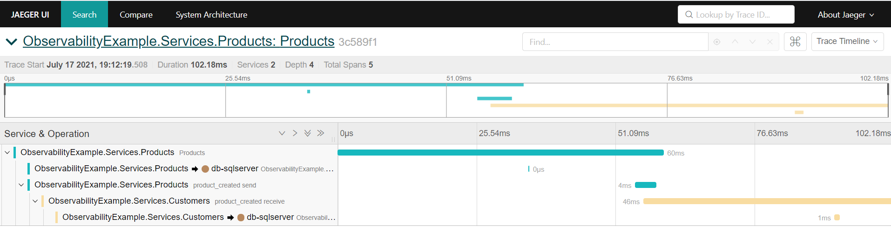

# ObservabilityExample

Simple example to show implementation of observability in .NET 5

### Solution Structure

- #### ObservabilityExample.Infrastructure:

The basics of observability (Tracing, Metrics, Logging) and RabbitMq implementation made. While making these implementations, the following libraries used:

**Tracing:**  OpenTelemetry's .NET libraries used.

**Metrics:** In OpenTelemetry, this part is still [under development](https://github.com/open-telemetry/opentelemetry-dotnet/issues/1501), so OpenTelemetry was not used. Instead, the prometheus-net library used.

**Logging:** Serilog and Seq used.

**RabbitMq:** RawRabbit library used because of its ease of implementation and middleware structure.

- #### ObservabilityExample.Services.Products:

It simply creates a product in its database. Then the **ProductCreated** event is published to RabbitMq.

- #### ObservabilityExample.Services.Customers:

It simply creates a client in its database. It has also subscribed to the **ProductCreated** event. When this event comes, it saves a sample of the product in its database.

### How to run the solution:

Open `ObservabilityExample/compose` directory and execute:

```
docker-compose -f external-apps-compose.yml up -d
```

It will run the required apps for observability. Then you can run the products and customers services together using:

```
docker-compose -f local-services.yml up -d
```

### How to observe the solution:

You can create a product using swagger at this link: http://localhost:5000/swagger/index.html 

##### Tracing

Then you can see traces using Jaeger at this link: http://localhost:16686/search


<p align="center"><em>Example of showing traces using Jaeger</em></p

##### Metrics

You can see metrics using Grafana at this link: http://localhost:3010/login 

If you don't want to use Grafana, you can also see metrics at this link: http://localhost:9090/

Then you can use the default username and password (**admin**) when logging into Grafana.

You can import pre-built dashboard for metrics if you want. Some of the pre-built dashboards:

- [prometheus-net Grafana Dashboard](https://grafana.com/grafana/dashboards/10427)
- [Prometheus RabbitMq Grafana Dashboard](https://grafana.com/grafana/dashboards/10991)

##### Logging

You can see logs using Seq at this link: http://localhost:5341/#/events


### TO DOs:

- [x] Add docker support
